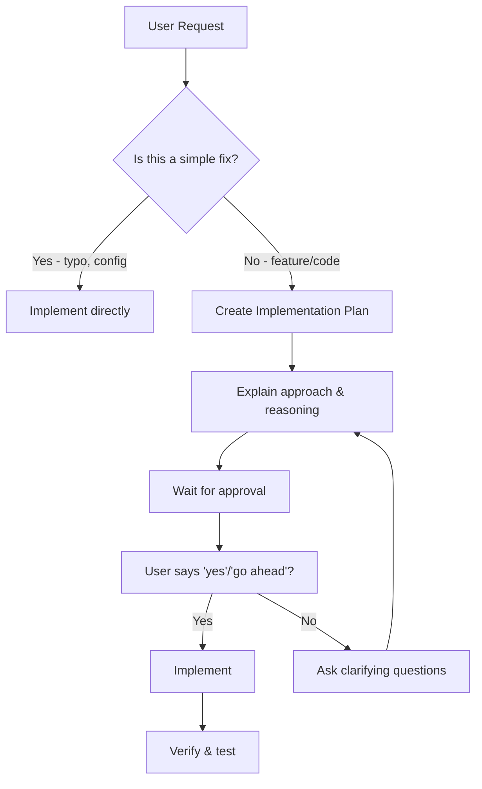

# Development Guidelines

**Status**: Active - This file is automatically included in all Kiro interactions

**Last Updated**: September 24, 2026

---

## Critical: Planning Before Implementation

### 🚫 DO NOT IMPLEMENT WITHOUT APPROVAL

When you receive a feature request, bug fix, or implementation task, you MUST follow this process:

1. **Analyze the request** - Understand what the user wants to achieve
2. **Make a plan** - Create a clear, step-by-step implementation plan
3. **Explain your reasoning** - Why you're choosing this approach
4. **Get explicit approval** - Wait for user confirmation before proceeding

### ✅ What constitutes "approval"?

Approval means the user explicitly says "yes", "go ahead", "implement", or similar confirmation. You should NOT proceed based on silence, vague agreements, or assumptions.

### 📋 What should your plan include?

For each implementation task, provide:

```markdown
## Implementation Plan

### Objective
[What we're trying to achieve]

### Approach
[High-level approach and why]

### Steps
1. [Step 1: Description]
2. [Step 2: Description]
3. [Step 3: Description]

### Files to be modified
- `path/to/file1` - [What will change]
- `path/to/file2` - [What will change]

### Questions for user
- [Any clarifying questions]
```

---

## When to Ask Questions

### Always ask for clarification if:

1. **Requirements are unclear** - User says "fix this" but doesn't specify expected behavior
2. **Multiple approaches exist** - There's more than one valid way to implement
3. **Scope is ambiguous** - User says "add this feature" but doesn't define scope
4. **Breaking changes** - The implementation will affect existing functionality
5. **Design decisions** - Architecture, naming, or structure choices need input

### Example of proper questioning:

```
I see you want to add search functionality. Before implementing, I need to clarify:

1. Should search work on all records or only filtered views?
2. Should search be case-sensitive or case-insensitive?
3. Should search results be immediate (debounced) or require a search button?

Which approach would you prefer, or do you have specific requirements?
```

---

## Autopilot vs Supervised Mode

### Autopilot Mode (Current)
- Kiro works autonomously to complete tasks end-to-end
- **BUT** - Still requires planning/approval for implementation tasks
- Changes can be viewed, reverted, or interrupted at any time

### Supervised Mode
- Kiro yields for approval after each turn with file edits
- Presents changes as individual hunks for fine-grained accept/reject control

**Current setting**: Autopilot mode, but with planning/approval requirement for implementation tasks.

---

## Quick Start for New Features



---

## Examples

### ❌ WRONG - Direct Implementation (DON'T DO THIS)

```
User: "Add pagination to the users API"
[Implementation proceeds without plan or approval]
```

### ✅ CORRECT - Plan + Approval

```
User: "Add pagination to the users API"

## Implementation Plan

**Objective**: Add pagination to /api/users endpoint

**Approach**: 
- Add `page` and `size` query parameters
- Use Spring Data JPA's Pageable interface
- Return paginated response with metadata

**Steps**:
1. Update UserController to accept page/size params
2. Update UserService to use Pageable
3. Create PaginationResponseDTO
4. Update tests

**Files to modify**:
- `backend/src/main/java/com/.../controller/UserController.java`
- `backend/src/main/java/com/.../service/UserService.java`
- `backend/src/main/java/com/.../dto/PaginationResponseDTO.java`

**Questions**:
- Default page size? (10 or 20?)
- Should page numbers be 0-based or 1-based?
```

---

## Summary Checklist

Before implementing any feature or significant change:

- [ ] I have analyzed the request
- [ ] I have created a plan
- [ ] I have explained my reasoning
- [ ] I have asked any clarifying questions
- [ ] I have received explicit approval
- [ ] I understand the requirements fully

If any answer is "NO" - STOP and ask for clarification or approval.

---

*This steering file is automatically included in all Kiro interactions for this workspace.*
